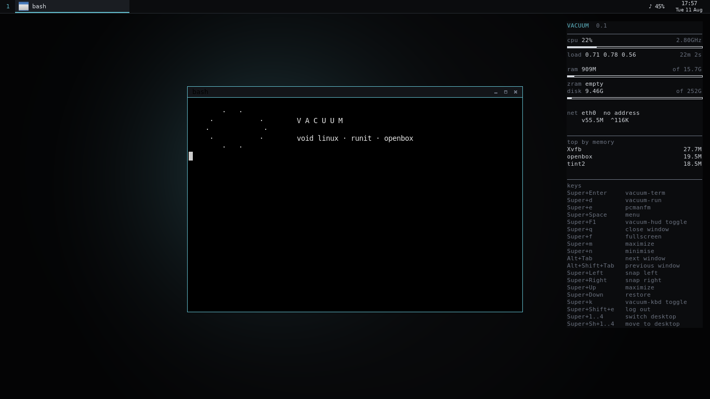

# Vacuum

A small desktop on top of Void Linux: runit, Xorg, Openbox, and nothing that
is not earning its place. Dark, flat, keyboard-first.

Vacuum is not a fork of Void — it is a build recipe. Everything here is a
package list, a set of configs, and a script that hands them to
[`void-mklive`](https://github.com/void-linux/void-mklive). The result is a
bootable live ISO that installs to disk with the stock Void installer, and
an installed system that is a normal Void system: `xbps-install` works, the
Void repositories work, Void's documentation applies.

- **Base:** Void Linux, glibc, x86_64
- **Init:** runit
- **Session:** Xorg + Openbox + tint2 + dunst + dmenu
- **Audio:** PipeWire
- **Memory:** zram (zstd, 60% of RAM) with matching `vm.*` tuning
- **Power:** TLP


*Openbox with the Vacuum theme, tint2 along the top, dunst top-right, and
`vacuum-ram` reporting what the session costs. Rendered under Xvfb in a
container, so the "whole machine" rows in that report belong to the build
host, not to Vacuum — the figure to read is the desktop total.*

---

## See a change without building anything

Most of what Vacuum is — the theme, the panel, notifications, keybindings,
the `vacuum-*` tools — lives under `rootfs/`, which `mklive` copies in at
the very end of a build. Rebuilding a 1.5 GB ISO to look at a colour is
half an hour spent on steps that have nothing to do with the change.

`./preview.sh` renders the working tree under Xvfb in a container that
stays warm between runs, and writes a PNG:

```sh
./preview.sh              # desktop: two terminals and a notification
./preview.sh menu         # the root menu, opened with a real Super+space
./preview.sh dmenu        # the launcher
./preview.sh files        # pcmanfm, to check the GTK dark theme
./preview.sh term         # one terminal
./preview.sh clean        # wallpaper and panel only
./preview.sh hud          # the side HUD

./preview.sh --size 1920x1080 menu
./preview.sh --stop       # drop the warm container
```

First call takes about a minute and a half to install the environment.
Every call after that is **1–3 seconds**. Renders land in `preview/`.

Configs are copied in fresh on every run and the session is restarted, so a
screenshot always shows the current working tree. The X server is the one
thing kept alive between runs — nothing Vacuum owns lives in it.

It also reports parse errors from Openbox and the autostart script: a
screenshot that looks right can still be hiding a config that failed to load
and silently fell back to a default.

What it does not cover: Xorg on real hardware, runit services, and anything
that happens before the session starts. Those still need an ISO.

## Build it

The build must run on Void, because it uses `xbps` to populate a chroot. On
anything else, `build.sh` wraps it in a Void container for you.

```sh
git clone https://github.com/FLEXIY0/Vacuum
cd Vacuum
./build.sh                    # needs docker; ~20 min, ~8 GB of scratch disk
./build.sh --version 0.2      # stamp a version into the image
./build.sh --native           # on Void itself, as root, no container
./build.sh --shell            # drop into the build container to poke around
```

The ISO and its checksum land in `out/`.

The container runs `--privileged`: `mklive` bind-mounts `/dev`, `/proc` and
`/sys` into the rootfs it is assembling and then chroots into it, and none
of that works under Docker's default capability set.

`.github/workflows/build-iso.yml` does the same thing on GitHub Actions —
run it by hand from the Actions tab, or push a `v*` tag to get an ISO
attached to a release.

### The one patch to void-mklive

`mk/patches/0001-efi-image-via-mtools.patch` is applied to the pinned
checkout at build time. Upstream builds the ISO's EFI System Partition by
attaching `efiboot.img` to a loop device and mounting it as vfat — both of
which come from the *host* kernel, not the container. On a kernel without
vfat the mount fails silently, the build finishes with status 0, and the
result is an ISO with an empty EFI volume: it boots on BIOS and does
nothing at all on UEFI.

The patch stages the EFI tree in an ordinary directory and copies it into
the FAT image with `mtools`, which needs no loop device and no kernel
support, and makes the step fail loudly if the loaders are missing.
`build-in-container.sh` then re-checks both boot paths in the finished ISO
before declaring success, because this is exactly the class of failure that
does not announce itself.

## Run it

Write the ISO to a USB stick and boot it — it is a hybrid image, so both
UEFI and BIOS machines will take it.

```sh
sha256sum -c out/vacuum-live-x86_64-*.iso.sha256
sudo dd if=out/vacuum-live-*.iso of=/dev/sdX bs=4M status=progress oflag=sync
```

The live session logs in automatically as `anon` (password `voidlinux`,
root the same) and starts the desktop on tty1.

## Install it

```sh
sudo vacuum-install
```

That wraps `void-installer`. One thing matters there: leave **Source** on
`Local`. Local copies the running Vacuum system to disk — desktop, theme,
tools and all. `Network` would fetch a stock Void `base-system` instead and
none of Vacuum would come along. The installer then removes the live-only
pieces (the `anon` user, its passwordless sudo rule, the tty1 autologin) and
rebuilds the initramfs for real hardware.

Vacuum has no automatic partitioner. The installer offers `cfdisk`.

---

## Updating an installed system

You do not reinstall to pick up changes. `vacuum-update` pulls the current
tree and applies it in place:

```sh
sudo vacuum-update             # fetch and apply
     vacuum-update --check     # show what would change, write nothing
sudo vacuum-update --rollback  # undo the last update
sudo vacuum-update --ref v0.2  # a specific branch, tag or commit
```

Also in the root menu, under **System → Update system…**

### It will not overwrite your edits

Every file is decided from three versions of itself: `base`, what shipped in
the version you are running; `new`, what ships now; and `live`, what is on
your disk.

| | |
| --- | --- |
| `live` missing | installed |
| `live` = `new` | nothing to do |
| `live` = `base` | you never touched it — replaced |
| otherwise | **yours** — kept, and the new version lands beside it as `<file>.new` |

That is what xbps does with a config file you have edited, applied to
Vacuum's own files. `base` is a snapshot of the tree applied last time, kept
under `/var/lib/vacuum/applied`, so it is exact rather than inferred from a
version number. On the first run there is no snapshot, so the tag matching
your installed version is fetched instead.

Files that were replaced are backed up under `/var/lib/vacuum/backups/`, and
`--rollback` restores the last one — including deleting files the update
added, so a rollback does not leave half a version behind.

### Your home directory is handled separately

`/etc/skel` only seeds *new* accounts, so updating it changes nothing for a
user who already exists. `vacuum-update` walks every home that looks like a
Vacuum session — one with `.config/openbox/rc.xml` — and applies the same
three-way rule there, preserving ownership.

### It also catches up on packages and services

A new feature can need a package the installed system never had.
`vacuum-update` diffs `packages/desktop.pkgs` against what is installed and
offers to fetch the difference, and enables any service in
`packages/services.list` that is not running yet.

### Following your own tree

Point `/etc/vacuum/update.conf` at your fork and branch:

```sh
VACUUM_REPO="you/Vacuum"
VACUUM_BRANCH="main"
```

Downloads go through `xbps-uhelper`, which exists on every Void system — a
bare install has no curl, no wget and no git, and this has to work on a
machine that has just come up.

## Keys

| Key | Action |
| --- | --- |
| `Super`+`Return` | Terminal |
| `Super`+`d` | Run a program (dmenu) |
| `Super`+`e` | File manager |
| `Super`+`space` | Root menu |
| `Super`+`q` | Close window |
| `Super`+`f` / `m` / `n` | Fullscreen / maximize / minimize |
| `Super`+`←` / `→` | Snap to left or right half |
| `Super`+`1`…`4` | Switch desktop |
| `Super`+`Shift`+`1`…`4` | Send window to desktop |
| `Alt`+`Tab` | Cycle windows |
| `Super`+`F1` | Show or hide the side HUD |
| `Super`+`k` | Keyboard backlight on or off |
| `Super`+`Shift`+`e` | Log out |

The volume and keyboard-brightness keys are bound too, where the machine
has them: `XF86AudioRaiseVolume` / `LowerVolume` / `Mute` and
`XF86KbdBrightnessUp` / `Down`.

Right-click the desktop for the root menu. `Alt` + drag moves a window from
anywhere in it; `Alt` + right-drag resizes.

Keyboard layouts default to `us,ru` with `Alt`+`Shift` to switch — change
that in `/etc/vacuum/xkb.conf`.

## What is running, and what it costs

Run `vacuum-ram` (or `sudo vacuum-ram` for exact numbers — reading another
user's proportional memory needs root, and Xorg is not your user).

It reports PSS, not RSS: shared libraries are split across the processes
that map them instead of being counted once per process. RSS totals for a
desktop like this typically read 40-60% high.

| Component | What it does | Memory |
| --- | --- | --- |
| Openbox | window manager | 9.6 MB |
| tint2 | panel | 9.0 MB |
| st | terminal, per window | 6.3 MB |
| dunst | notifications | 4.7 MB |
| D-Bus | session bus | 0.7 MB |
| dmenu | launcher — spawned on a key, then gone | 0 MB |
| nitrogen / feh | wallpaper — sets it and exits | 0 MB |
| pcmanfm | file manager, on demand | 0 MB |
| **Desktop layer** | **the rows above, idle** | **~30 MB** |
| Xorg (`xorg-minimal`) | display server | 30–50 MB |
| Void base + runit | kernel, init, base services | 35–45 MB |
| PipeWire + WirePlumber | audio | ~15 MB |
| zram + TLP | compressed swap, power management | ~5 MB |
| **Total** | **desktop, idle, no browser** | **~115–145 MB** |

The measured rows come from `vacuum-ram` in a 1366×768 session; the
estimated ones are ranges because they genuinely vary — Xorg's footprint
depends on the driver and the resolution, and the base system depends on
which services you leave running.

Two notes on where this differs from the usual sketch of a setup like this.
Openbox and tint2 are commonly quoted at 2 MB and 8 MB; measured by PSS
they are closer to 9 MB each, because a quote that low is counting private
memory and ignoring the toolkit and font pages the process actually needs.
And audio plus a session bus — the last of the additions to the original
package list — cost about 16 MB between them. That is the price of a
desktop that can play sound and mount a USB stick rather than one that only
looks the part. Drop `pipewire`, `wireplumber` and `alsa-pipewire` from
`packages/desktop.pkgs` if you would rather have the memory.

## Why the ISO is 1.5 GB when the desktop is 30 MB

Those two numbers measure different things, and neither is wrong.

The ISO carries every driver blob the image might need on hardware it has
never seen. Measured from the Void repository:

| | |
| --- | --- |
| `linux-firmware-network` | 438 MB |
| `linux6.18` (kernel + modules) | 166 MB |
| `linux-firmware-nvidia` | 106 MB |
| `sof-firmware` | 43 MB |
| `linux-firmware-amd` | 31 MB |
| everything else with firmware in the name | ~39 MB |
| **firmware and kernel** | **~823 MB** |
| Openbox, tint2, dunst, dmenu, st, pcmanfm | ~6 MB |

None of it costs memory. The kernel loads only the blobs the hardware in
front of it asks for, so a laptop with an Intel card never pages in the
Nvidia firmware — it just travelled on the ISO.

If you are building for a machine you already own, `packages/ignore.list`
takes the vendors you do not have out of the image; the comments in that
file list the measured sizes. Dropping `linux-firmware-network` roughly
halves the ISO and leaves most laptops with no Wi-Fi, which is why it is
not the default for an image meant to install itself onto unknown hardware.

## zram

`zramen` creates a zstd-compressed swap device sized at 60% of RAM, and
`/etc/sysctl.d/99-vacuum.conf` sets `vm.swappiness=100` and
`vm.page-cluster=0` so the kernel actually uses it and reads it a page at a
time. zstd gets roughly 3–4× on desktop working sets against lz4's 2–2.5×,
which is the trade worth making when RAM is the scarce resource and the CPU
is idle anyway.

On a machine with plenty of RAM this costs nothing: zram allocates physical
pages lazily, so an untouched device is nearly free. Tune it in
`/etc/sv/zramen/conf`.

---

## Layout

```
build.sh                  host entry point: wraps the build in a container
preview.sh                screenshot the desktop in seconds, no ISO needed
mk/
  build-in-container.sh   the actual build; POSIX sh, runs on Void
  postsetup.sh            runs against the finished rootfs before initramfs
  preview-session.sh      the render, inside the preview container
  patches/                applied to the pinned void-mklive checkout
  gen-wallpaper.py        regenerates the wallpaper, no dependencies
  palette.sh              the palette, in one place
packages/
  desktop.pkgs            what gets installed on top of base-system
  services.list           what runit enables
  ignore.list             what to keep out — the ISO-size knob
rootfs/                   copied verbatim over the image's filesystem
  etc/skel/               the user's default configs
  etc/vacuum/             system-wide knobs for the vacuum-* tools
  usr/bin/vacuum-*        the tools below
  usr/share/themes/Vacuum openbox theme
```

`rootfs/` is the whole of Vacuum's userland customisation. Add a file there
and it appears in the image; there is no other mechanism.

## Tools

| Command | What it does |
| --- | --- |
| `vacuum-term` | st, with a font it can actually be given |
| `vacuum-run` | dmenu, in the Vacuum palette |
| `vacuum-ram` | the memory report above |
| `vacuum-hud` | show or hide the side HUD |
| `vacuum-keys` | the shortcut list, read from rc.xml |
| `vacuum-stat` | net rate and zram ratio, for the HUD |
| `vacuum-wifi` | scan for networks and join one |
| `vacuum-vol` | volume, for the panel and the media keys |
| `vacuum-sound` | why there is no sound, and `--fix` for it |
| `vacuum-kbd` | keyboard backlight, and `--probe` for what the machine has |
| `vacuum-update` | update an installed system from this repository |
| `vacuum-install` | install to disk (wraps `void-installer`) |
| `vacuum-battery-warn` | tint2's low-battery hook, called by the panel |

The first two exist because Void builds `st` and `dmenu` from vanilla
sources: neither reads a config file or the X resource database, so the
only way to theme them is on the command line. The wrappers are that command
line, and they read their defaults from `/etc/vacuum/`.

## The side HUD



A conky panel down the right edge: CPU, load, memory, zram, disk, network
and battery, the three largest processes by memory — and the keyboard
shortcuts.

```sh
vacuum-hud            # toggle          (also Super+F1)
vacuum-hud on|off
vacuum-hud status
```

Whether it was on is remembered, so a session comes back the way you left
it. It costs about 10 MB resident and 2 MB on disk; `Super+F1` is there
because on a small screen it is sometimes in the way.

**The shortcut list is generated, not written down.** `vacuum-keys` parses
`~/.config/openbox/rc.xml`, so it shows the bindings that are actually
loaded. A cheatsheet that can disagree with the running configuration is
worse than none, and this one cannot — rebind a key and the HUD follows.

```sh
vacuum-keys           # the ones worth remembering
vacuum-keys --all     # every binding, media keys included
```

`vacuum-stat` supplies the two readings conky cannot take itself: network
rate, and zram's compression ratio. Network rate needs an interface name up
front, and that name differs between machines and changes when you move
between wired and wireless — so it reads the default route from
`/proc/net/route` instead, with no process spawned and nothing to install.

## Wi-Fi

```sh
vacuum-wifi              # scan, pick a network from a numbered list, connect
vacuum-wifi --status     # what is connected, and on which address
vacuum-wifi --list       # scan and print, without connecting
vacuum-wifi --forget     # drop a saved network
```

Also in the root menu, under **Wi-Fi…**

It drives the `wpa_supplicant` that runit is already running, so it adds no
daemon and no package — the alternative, NetworkManager with a tray applet,
would cost about 25 MB resident for the same result. Void's stock
`wpa_supplicant.conf` sets `ctrl_interface_group=wheel` and
`update_config=1`, which is what lets scanning and saving work as an
ordinary user with no `sudo` anywhere in the flow.

Passphrases are run through `wpa_passphrase` before being saved, so the PSK
hash is what lands in `wpa_supplicant.conf` and the plaintext never does.
Networks are only written to disk once the association actually succeeds,
so a typo does not leave a broken entry behind.

The picker is a numbered list rather than a graphical menu on purpose: the
same command then works on a bare tty, over SSH, and in a terminal window —
including the case that matters most, a fresh install with no working
network and no desktop yet.

## Sound

The panel carries the volume next to the clock. Scroll it to change,
click to mute, right-click for `alsamixer`. The media keys do the same
thing, and show the new level as a notification, because the panel only
refreshes every two seconds and a key press should not have to wait.

Both go through `vacuum-vol`, which reads PipeWire when it is running and
falls back to the ALSA mixer when it is not — so volume still works over
SSH, or in a session where PipeWire failed to start.

### If there is no sound at all

```sh
vacuum-sound              # what is wrong
sudo vacuum-sound --fix   # fix what can be fixed
vacuum-sound --test       # a 440 Hz tone
```

Silence on a fresh install is almost never a missing driver. The kernel
brings an HDA codec up with its outputs **muted and its levels at zero**,
and something has to run `alsactl init` to turn them on. Until v0.2 nothing
did: `alsa-utils` was not installed, so there was no `alsactl` on the system
and no service to run it at boot. PipeWire reported a healthy sink at 100%
the whole time, which is what made it confusing — the hardware mixer
underneath it was off.

v0.2 ships `alsa-utils` and enables the `alsa` service, which restores the
mixer at boot and saves it at shutdown. `vacuum-sound` walks the whole
chain — card, device nodes, mixer, group membership, service, PipeWire sink
— and names the link that is broken rather than leaving you to guess.

## Keyboard backlight

```sh
vacuum-kbd            # toggle, same as Super+K
vacuum-kbd up|down    # for backlights with more than one level
vacuum-kbd --probe    # what this machine actually exposes
```

To the kernel a keyboard backlight is just a LED: a driver that knows the
machine registers it under `/sys/class/leds`, and a number written to
`brightness` turns it on. What differs between laptops is whether such a
driver exists at all — on some the backlight is wired to the embedded
controller, the `Fn` key toggles it in hardware, and the operating system is
never told. There is no software path on those, and no amount of
configuration invents one.

So `--probe` reports rather than guesses: every LED node present, the
machine's own DMI identification, which vendor modules are loaded, and — if
nothing turned up — the three reasons why, in order of likelihood.

Writing to the node needs group `video`, granted by
`/etc/udev/rules.d/70-vacuum-leds.rules`. That group rather than `input`,
which is what `brightnessctl`'s equivalent rule uses: `input` carries read
access to every input device on the machine, i.e. to every keystroke typed
on it, which is a great deal to hand out for the sake of a backlight.
`video` is already in the set `void-installer` gives a new user, so this
works on an existing install with nothing to add.

## Palette

| | |
| --- | --- |
| background | `#0b0c0e` |
| raised surface | `#131519` |
| hover / selected | `#1a1d22` |
| border | `#262a31` |
| text | `#d2d6dc` |
| dim text | `#6b7280` |
| accent | `#5fb8c7` |
| urgent | `#d4796a` |

One accent, used sparingly: the focused window's border, the active task
underline, the dmenu selection. Everything else is greyscale.

## Licence

Vacuum's own configs and scripts are MIT (see `LICENSE`). The image is built
from Void Linux packages and `void-mklive`, which carry their own licences —
`void-mklive` is 2-clause BSD, and everything in the image is whatever its
upstream says it is.
