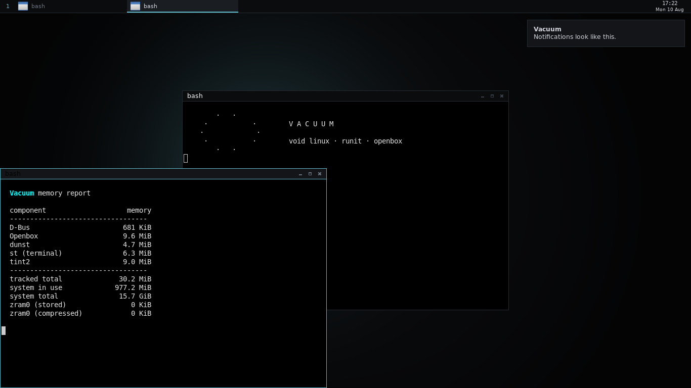

# Vacuum

A small desktop on top of Void Linux: runit, Xorg, Openbox, and nothing that
is not earning its place. Dark, flat, keyboard-first.

Vacuum is not a fork of Void — it is a build recipe. Everything here is a
package list, a set of configs, and a script that hands them to
[`void-mklive`](https://github.com/void-linux/void-mklive). The result is a
bootable live ISO that installs to disk with the stock Void installer, and
an installed system that is a normal Void system: `xbps-install` works, the
Void repositories work, Void's documentation applies.

- **Base:** Void Linux, glibc, x86_64
- **Init:** runit
- **Session:** Xorg + Openbox + tint2 + dunst + dmenu
- **Audio:** PipeWire
- **Memory:** zram (zstd, 60% of RAM) with matching `vm.*` tuning
- **Power:** TLP



*Openbox with the Vacuum theme, tint2 along the top, dunst top-right, and
`vacuum-ram` reporting what the session costs. Rendered under Xvfb in a
container, so the "whole machine" rows in that report belong to the build
host, not to Vacuum — the figure to read is the desktop total.*

---

## Build it

The build must run on Void, because it uses `xbps` to populate a chroot. On
anything else, `build.sh` wraps it in a Void container for you.

```sh
git clone https://github.com/FLEXIY0/Vacuum
cd Vacuum
./build.sh                    # needs docker; ~20 min, ~8 GB of scratch disk
./build.sh --version 0.2      # stamp a version into the image
./build.sh --native           # on Void itself, as root, no container
./build.sh --shell            # drop into the build container to poke around
```

The ISO and its checksum land in `out/`.

The container runs `--privileged`: `mklive` bind-mounts `/dev`, `/proc` and
`/sys` into the rootfs it is assembling and then chroots into it, and none
of that works under Docker's default capability set.

`.github/workflows/build-iso.yml` does the same thing on GitHub Actions —
run it by hand from the Actions tab, or push a `v*` tag to get an ISO
attached to a release.

### The one patch to void-mklive

`mk/patches/0001-efi-image-via-mtools.patch` is applied to the pinned
checkout at build time. Upstream builds the ISO's EFI System Partition by
attaching `efiboot.img` to a loop device and mounting it as vfat — both of
which come from the *host* kernel, not the container. On a kernel without
vfat the mount fails silently, the build finishes with status 0, and the
result is an ISO with an empty EFI volume: it boots on BIOS and does
nothing at all on UEFI.

The patch stages the EFI tree in an ordinary directory and copies it into
the FAT image with `mtools`, which needs no loop device and no kernel
support, and makes the step fail loudly if the loaders are missing.
`build-in-container.sh` then re-checks both boot paths in the finished ISO
before declaring success, because this is exactly the class of failure that
does not announce itself.

## Run it

Write the ISO to a USB stick and boot it — it is a hybrid image, so both
UEFI and BIOS machines will take it.

```sh
sha256sum -c out/vacuum-live-x86_64-*.iso.sha256
sudo dd if=out/vacuum-live-*.iso of=/dev/sdX bs=4M status=progress oflag=sync
```

The live session logs in automatically as `anon` (password `voidlinux`,
root the same) and starts the desktop on tty1.

## Install it

```sh
sudo vacuum-install
```

That wraps `void-installer`. One thing matters there: leave **Source** on
`Local`. Local copies the running Vacuum system to disk — desktop, theme,
tools and all. `Network` would fetch a stock Void `base-system` instead and
none of Vacuum would come along. The installer then removes the live-only
pieces (the `anon` user, its passwordless sudo rule, the tty1 autologin) and
rebuilds the initramfs for real hardware.

Vacuum has no automatic partitioner. The installer offers `cfdisk`.

---

## Keys

| Key | Action |
| --- | --- |
| `Super`+`Return` | Terminal |
| `Super`+`d` | Run a program (dmenu) |
| `Super`+`e` | File manager |
| `Super`+`space` | Root menu |
| `Super`+`q` | Close window |
| `Super`+`f` / `m` / `n` | Fullscreen / maximize / minimize |
| `Super`+`←` / `→` | Snap to left or right half |
| `Super`+`1`…`4` | Switch desktop |
| `Super`+`Shift`+`1`…`4` | Send window to desktop |
| `Alt`+`Tab` | Cycle windows |
| `Super`+`Shift`+`e` | Log out |

Right-click the desktop for the root menu. `Alt` + drag moves a window from
anywhere in it; `Alt` + right-drag resizes.

Keyboard layouts default to `us,ru` with `Alt`+`Shift` to switch — change
that in `/etc/vacuum/xkb.conf`.

## What is running, and what it costs

Run `vacuum-ram` (or `sudo vacuum-ram` for exact numbers — reading another
user's proportional memory needs root, and Xorg is not your user).

It reports PSS, not RSS: shared libraries are split across the processes
that map them instead of being counted once per process. RSS totals for a
desktop like this typically read 40-60% high.

| Component | What it does | Memory |
| --- | --- | --- |
| Openbox | window manager | 9.6 MB |
| tint2 | panel | 9.0 MB |
| st | terminal, per window | 6.3 MB |
| dunst | notifications | 4.7 MB |
| D-Bus | session bus | 0.7 MB |
| dmenu | launcher — spawned on a key, then gone | 0 MB |
| nitrogen / feh | wallpaper — sets it and exits | 0 MB |
| pcmanfm | file manager, on demand | 0 MB |
| **Desktop layer** | **the rows above, idle** | **~30 MB** |
| Xorg (`xorg-minimal`) | display server | 30–50 MB |
| Void base + runit | kernel, init, base services | 35–45 MB |
| PipeWire + WirePlumber | audio | ~15 MB |
| zram + TLP | compressed swap, power management | ~5 MB |
| **Total** | **desktop, idle, no browser** | **~115–145 MB** |

The measured rows come from `vacuum-ram` in a 1366×768 session; the
estimated ones are ranges because they genuinely vary — Xorg's footprint
depends on the driver and the resolution, and the base system depends on
which services you leave running.

Two notes on where this differs from the usual sketch of a setup like this.
Openbox and tint2 are commonly quoted at 2 MB and 8 MB; measured by PSS
they are closer to 9 MB each, because a quote that low is counting private
memory and ignoring the toolkit and font pages the process actually needs.
And audio plus a session bus — the last of the additions to the original
package list — cost about 16 MB between them. That is the price of a
desktop that can play sound and mount a USB stick rather than one that only
looks the part. Drop `pipewire`, `wireplumber` and `alsa-pipewire` from
`packages/desktop.pkgs` if you would rather have the memory.

## Why the ISO is 1.5 GB when the desktop is 30 MB

Those two numbers measure different things, and neither is wrong.

The ISO carries every driver blob the image might need on hardware it has
never seen. Measured from the Void repository:

| | |
| --- | --- |
| `linux-firmware-network` | 438 MB |
| `linux6.18` (kernel + modules) | 166 MB |
| `linux-firmware-nvidia` | 106 MB |
| `sof-firmware` | 43 MB |
| `linux-firmware-amd` | 31 MB |
| everything else with firmware in the name | ~39 MB |
| **firmware and kernel** | **~823 MB** |
| Openbox, tint2, dunst, dmenu, st, pcmanfm | ~6 MB |

None of it costs memory. The kernel loads only the blobs the hardware in
front of it asks for, so a laptop with an Intel card never pages in the
Nvidia firmware — it just travelled on the ISO.

If you are building for a machine you already own, `packages/ignore.list`
takes the vendors you do not have out of the image; the comments in that
file list the measured sizes. Dropping `linux-firmware-network` roughly
halves the ISO and leaves most laptops with no Wi-Fi, which is why it is
not the default for an image meant to install itself onto unknown hardware.

## zram

`zramen` creates a zstd-compressed swap device sized at 60% of RAM, and
`/etc/sysctl.d/99-vacuum.conf` sets `vm.swappiness=100` and
`vm.page-cluster=0` so the kernel actually uses it and reads it a page at a
time. zstd gets roughly 3–4× on desktop working sets against lz4's 2–2.5×,
which is the trade worth making when RAM is the scarce resource and the CPU
is idle anyway.

On a machine with plenty of RAM this costs nothing: zram allocates physical
pages lazily, so an untouched device is nearly free. Tune it in
`/etc/sv/zramen/conf`.

---

## Layout

```
build.sh                  host entry point: wraps the build in a container
mk/
  build-in-container.sh   the actual build; POSIX sh, runs on Void
  postsetup.sh            runs against the finished rootfs before initramfs
  patches/                applied to the pinned void-mklive checkout
  gen-wallpaper.py        regenerates the wallpaper, no dependencies
  palette.sh              the palette, in one place
packages/
  desktop.pkgs            what gets installed on top of base-system
  services.list           what runit enables
  ignore.list             what to keep out — the ISO-size knob
rootfs/                   copied verbatim over the image's filesystem
  etc/skel/               the user's default configs
  etc/vacuum/             system-wide knobs for the vacuum-* tools
  usr/bin/vacuum-*        the tools below
  usr/share/themes/Vacuum openbox theme
```

`rootfs/` is the whole of Vacuum's userland customisation. Add a file there
and it appears in the image; there is no other mechanism.

## Tools

| Command | What it does |
| --- | --- |
| `vacuum-term` | st, with a font it can actually be given |
| `vacuum-run` | dmenu, in the Vacuum palette |
| `vacuum-ram` | the memory report above |
| `vacuum-install` | install to disk (wraps `void-installer`) |
| `vacuum-battery-warn` | tint2's low-battery hook, called by the panel |

The first two exist because Void builds `st` and `dmenu` from vanilla
sources: neither reads a config file or the X resource database, so the
only way to theme them is on the command line. The wrappers are that command
line, and they read their defaults from `/etc/vacuum/`.

## Palette

| | |
| --- | --- |
| background | `#0b0c0e` |
| raised surface | `#131519` |
| hover / selected | `#1a1d22` |
| border | `#262a31` |
| text | `#d2d6dc` |
| dim text | `#6b7280` |
| accent | `#5fb8c7` |
| urgent | `#d4796a` |

One accent, used sparingly: the focused window's border, the active task
underline, the dmenu selection. Everything else is greyscale.

## Licence

Vacuum's own configs and scripts are MIT (see `LICENSE`). The image is built
from Void Linux packages and `void-mklive`, which carry their own licences —
`void-mklive` is 2-clause BSD, and everything in the image is whatever its
upstream says it is.
